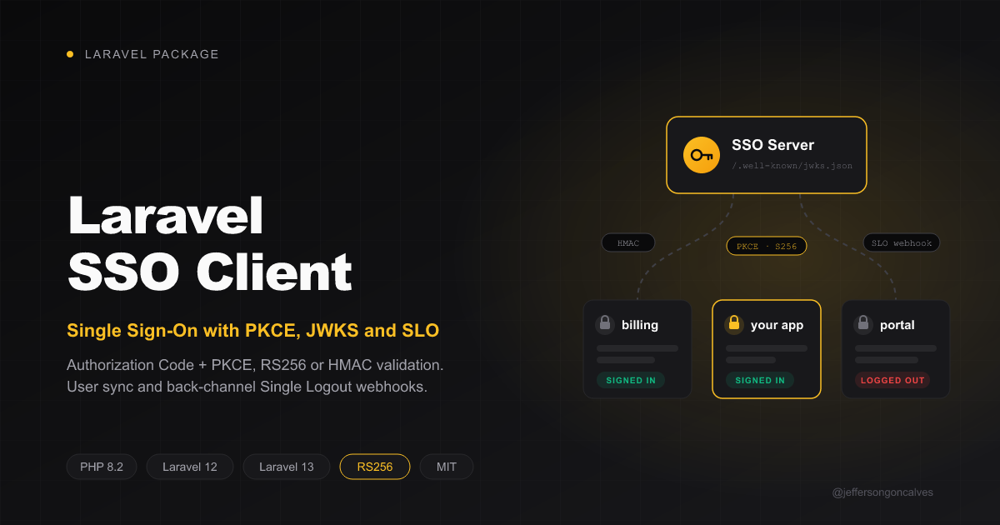

<div class="filament-hidden">



</div>

# Laravel SSO Client

[](https://packagist.org/packages/jeffersongoncalves/laravel-sso-client)
[](https://github.com/jeffersongoncalves/laravel-sso-client/actions?query=workflow%3ATests+branch%3Amain)
[](https://github.com/jeffersongoncalves/laravel-sso-client/actions?query=workflow%3Apint+branch%3Amain)
[](https://packagist.org/packages/jeffersongoncalves/laravel-sso-client)
[](LICENSE.md)

SSO client for Laravel apps that authenticate against [`jeffersongoncalves/laravel-sso-server`](https://github.com/jeffersongoncalves/laravel-sso-server): Authorization Code + PKCE login, RS256/JWKS or signed userinfo token validation, local user sync and back-channel Single Logout.

## Compatibility

| Package | PHP | Laravel | laravel-sso-server |
|---------|-----|---------|--------------------|
| 1.x     | 8.2+ | 12.x, 13.x | 1.x (1.1+ for `email_verified` and client-initiated logout) |

## Installation

On the **server** app, register this client (prints the `client_id` and `client_secret`):

```bash
php artisan sso-server:client "Billing" https://billing.example.com/sso/callback --slo=https://billing.example.com/sso/slo-webhook
```

On the **client** app:

```bash
composer require jeffersongoncalves/laravel-sso-client
php artisan vendor:publish --tag="sso-client-config"
php artisan vendor:publish --tag="sso-client-migrations"
php artisan migrate
```

The migration adds a nullable, unique `sso_id` column to `users`: it stores the server's `sub`, the only stable identity of an SSO user.

```dotenv
SSO_SERVER_URL=https://sso.example.com
SSO_CLIENT_ID=<client_id>
SSO_CLIENT_SECRET=<client_secret>
# Optional: the server's sso-server.issuer when it differs from SSO_SERVER_URL
SSO_ISSUER=
# jwks (local, default) or userinfo (asks the server on every login)
SSO_VERIFICATION=jwks
```

The redirect URI sent to the server defaults to this package's callback route and must match the registered one exactly (override with `SSO_REDIRECT_URI`).

## Usage

Protect routes with the `sso.auth` middleware. Guests are sent to the SSO Server and come back to the URL they asked for; sessions revoked by Single Logout are ended here too:

```php
Route::middleware(['web', 'sso.auth'])->group(function () {
    Route::get('/dashboard', DashboardController::class);
});
```

Routes registered by the package (prefix configurable via `sso-client.route.prefix`):

| Method | URI | Name | Purpose |
|--------|-----|------|---------|
| GET  | `/sso/redirect`    | `sso-client.redirect`    | Starts the flow (state + PKCE S256) |
| GET  | `/sso/callback`    | `sso-client.callback`    | Checks state, exchanges the code, logs in |
| POST | `/sso/logout`      | `sso-client.logout`      | Ends the local session, then the SSO session and the user's other apps (CSRF-protected) |
| POST | `/sso/slo-webhook` | `sso-client.slo-webhook` | Back-channel Single Logout (no session, no CSRF, HMAC-authenticated) |

The server paths (`/sso/authorize`, `/sso/token`, `/sso/userinfo`, `/sso/logout`, `/.well-known/jwks.json`) are configurable in `sso-client.endpoints` to follow the server's route prefix.

### Logging out

Point the app's logout button at `sso-client.logout`:

```blade
<form method="POST" action="{{ route('sso-client.logout') }}">
    @csrf
    <button type="submit">Log out</button>
</form>
```

The local session is destroyed first; then the browser goes to the server (`laravel-sso-server` 1.1+), which ends the SSO session, sends the Single Logout webhook to the user's other client apps and returns to `sso-client.post_logout_redirect_uri` (default: the `home` URL; it must share the origin of the redirect URI). Users who did not sign in through SSO are only logged out locally.

### Custom user synchronization

The default synchronizer links local users to the server's `sub` (`sso-client.user.sso_id_column`) and keeps the columns in `sso-client.user.attributes` in sync (`name` and `email` with the server's default serializer). New users get a random, unusable password.

| Situation on login | Result |
|--------------------|--------|
| A user with this `sub` exists | Updated and logged in (even if the email changed on the server) |
| No user with this `sub` or this email | Created and linked |
| A local user with this email exists, not linked | **Rejected** (`AccountLinkingException`, 401) unless `link_existing_users_by_email` is `true` **and** the `email_verified` claim is `true` |
| A local user with this email is linked to another `sub` | Always rejected |

Emails are mutable, so trusting an unverified one to take over an existing account would let anyone who registers that address on the server sign in as the local user. `laravel-sso-server` 1.1+ sends an `email_verified` claim, and email linking is refused unless it is exactly `true`; older servers do not send it, and then `link_existing_users_by_email => true` is your statement that the server verifies every email. Enable the flag only when needed (e.g. to adopt pre-SSO accounts). Setting `sso_id_column => null` matches users by email only (legacy mode); existing users are still refused when `email_verified` is `false`.

To keep users in memory only or map roles, implement the contract and set `sso-client.synchronizer`:

```php
use Illuminate\Contracts\Auth\Authenticatable;
use JeffersonGoncalves\SsoClient\Contracts\SsoUserSynchronizerContract;

class RoleAwareSynchronizer implements SsoUserSynchronizerContract
{
    public function synchronize(array $ssoPayload): Authenticatable
    {
        $user = User::updateOrCreate(
            ['sso_id' => $ssoPayload['sub']],
            ['name' => $ssoPayload['name'], 'email' => $ssoPayload['email']],
        );

        $user->syncRoles($ssoPayload['roles'] ?? []);

        return $user;
    }
}
```

### Events

| Event | When |
|-------|------|
| `UserSynchronizedEvent` | After the synchronizer returns, before login (`$user`, `$ssoPayload`) |
| `SsoLoginFailedEvent` | Any callback failure (`$exception`); the browser only gets a generic 401 |
| `SsoRemoteLogoutReceivedEvent` | A new, valid Single Logout webhook (`$sub`: the server user id) |

Failures are subclasses of `SsoClientException`: `InvalidStateException`, `InvalidSignatureException`, `TokenExpiredException`, `SsoClientMismatchException` (wrong `iss`/`aud`, or `invalid_client`), `TokenReplayedException`, `SsoServerUnreachableException`, `AccountLinkingException`.

## How it works

1. **Authorize.** `/sso/redirect` stores a random `state` (40 chars) and `code_verifier` (64 chars) in the session and redirects to `{server}/sso/authorize` with `code_challenge = base64url(sha256(verifier))` and `code_challenge_method=S256`.
2. **Callback.** The `state` is pulled from the session (single use) and compared with `hash_equals`. The code is exchanged right away (it lives 60 s and is burned on any attempt) with a form `POST {server}/sso/token` carrying `client_id`, `client_secret`, `code`, `redirect_uri` and `code_verifier`. Only network failures are retried (3 attempts, 100 ms apart); `invalid_request`/`invalid_grant`/`invalid_client` fail immediately.
3. **Verification.**
   - `jwks`: the `access_token` is verified locally against `{server}/.well-known/jwks.json` (cached for `jwks_cache_ttl`, refetched once on an unknown `kid`, so key rotation just works). Only `RS256` is accepted; `iss`, `aud`, `exp`, `nbf` (with `leeway`) are checked and each `jti` is accepted once.
   - `userinfo`: `GET {server}/sso/userinfo` with the Bearer token. The response must carry a valid `X-SSO-Signature` over the raw body and a fresh `X-SSO-Timestamp`. Costs a round-trip, but the server rejects users who already logged out.
4. **Login.** The synchronizer resolves the local user by `sub` (see the table above), which is logged into the configured guard; the session is regenerated and remembers the server `sub` and the access token (the `token_hint` for logout).
5. **Client-initiated logout.** `POST /sso/logout` destroys the local session and redirects to `{server}/sso/logout?client_id=...&token_hint=...&post_logout_redirect_uri=...`. The server revokes all of the user's SSO sessions and notifies every other client through the webhook below (not this one).
6. **Single Logout.** When the user logs out on the server, it POSTs `{"event":"logout","sub","aud","iat","jti"}` to the webhook. The client checks `X-SSO-Signature = HMAC-SHA256("{X-SSO-Timestamp}.{raw body}", client_secret)` and a timestamp within `signature_tolerance` (300 s), then `event` and `aud`, and answers `204`. A replayed `jti` is acknowledged but ignored, so the server stops retrying. Every local session of that `sub` started before the webhook is ended by `sso.auth` on its next request.

### Production notes

- Use a shared, atomic cache store (Redis, Memcached, database): the `jti` anti-replay markers and the Single Logout markers live there, and every app server must see them.
- Revocation is enforced by `sso.auth`: routes without it do not see a remote logout.
- In `jwks` mode a token stays valid until it expires; logout reaches the client only through the webhook. Use `userinfo` if you need the server to confirm every login.
- The access token is kept in the session for logout: use a server-side session driver or keep the (encrypted) cookie driver's default encryption on.

## Testing

```bash
composer test
```

The suite includes interop tests that run the real `laravel-sso-server` (dev dependency) against this client: login in both verification modes and Single Logout.

## Changelog

Please see [CHANGELOG](CHANGELOG.md) for more information on what has changed recently.

## Security

If you discover any security related issues, please email the author instead of using the issue tracker.

## Credits

- [Jefferson Gonçalves](https://github.com/jeffersongoncalves)
- [All Contributors](../../contributors)

## License

The MIT License (MIT). Please see [License File](LICENSE.md) for more information.
